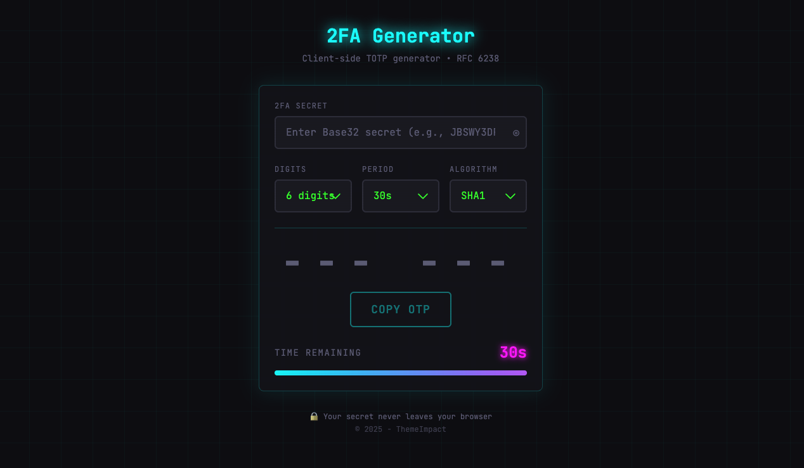

# 2FA Generator

[](https://opensource.org/licenses/MIT)
[](https://2fa.themeimpact.com)

A **secure, client-side TOTP (Time-based One-Time Password) generator** with a neon terminal aesthetic. Your secrets never leave your browser.

🔗 **Live Demo:** [https://2fa.themeimpact.com](https://2fa.themeimpact.com)



## ✨ Features

- 🔒 **100% Client-Side** - No server requests, no data storage
- ⚡ **RFC 6238 Compliant** - Compatible with Google Authenticator, Authy, etc.
- 🎨 **Neon Terminal Theme** - Cyberpunk/hacker aesthetic with glow effects
- 📱 **Responsive Design** - Works on desktop and mobile
- 🔄 **Auto-Refresh** - Codes regenerate automatically
- 📋 **Bulk Generation** - Generate multiple codes at once

## 🛡️ Security

- ❌ No server requests for OTP generation
- ❌ No localStorage/sessionStorage usage
- ❌ No console logging of secrets
- ❌ No analytics or tracking
- ✅ Secrets cleared on page refresh
- ✅ All cryptography via Web Crypto API

## 🚀 Quick Start

### Prerequisites

- Node.js 20+
- Yarn

### Installation

```bash
# Clone the repository
git clone https://github.com/themeimpact/2fa-generator.git
cd 2fa-generator

# Install dependencies
yarn install

# Start development server
yarn dev
```

Open [http://localhost:5001](http://localhost:5001) in your browser.

### Build for Production

```bash
yarn build
```

### Deploy to Cloudflare Pages

```bash
yarn deploy
```

## 📖 Usage

### Single Mode (`/`)

1. Enter your Base32-encoded 2FA secret
2. (Optional) Adjust digits, period, and algorithm
3. Copy the generated OTP

### Bulk Mode (`/bulk`)

1. Enter multiple secrets (one per line)
2. Click "Generate All Codes"
3. Copy output in `secret|code` format

## ⚙️ Configuration Options

| Option | Values | Default | Description |
|--------|--------|---------|-------------|
| Digits | 6, 8 | 6 | OTP code length |
| Period | 30s, 60s | 30s | Code refresh interval |
| Algorithm | SHA1, SHA256, SHA512 | SHA1 | HMAC algorithm |

## 🏗️ Tech Stack

- **Framework:** Next.js 14 (App Router)
- **Language:** TypeScript
- **Styling:** Tailwind CSS
- **Deployment:** Cloudflare Pages
- **Crypto:** Web Crypto API (native)

## 📁 Project Structure

```
src/
├── app/                    # Next.js app router
│   ├── page.tsx           # Single generator page
│   ├── bulk/page.tsx      # Bulk generator page
│   └── layout.tsx         # Root layout
├── components/            # React components
│   ├── header.tsx         # Navigation header
│   ├── totp-generator.tsx # Single TOTP generator
│   ├── bulk-generator.tsx # Bulk TOTP generator
│   ├── countdown-timer.tsx # Shared timer component
│   └── ui/                # Reusable UI components
├── lib/
│   └── totp/              # TOTP implementation
│       ├── totp.ts        # RFC 6238 TOTP
│       ├── hmac.ts        # HMAC-SHA wrapper
│       └── base32.ts      # Base32 decoder
├── hooks/                 # Custom React hooks
└── types/                 # TypeScript definitions
```

## 🧪 Testing

```bash
# Run tests
yarn test

# Run tests once
yarn test:run
```

Tests include RFC 6238 official test vectors to ensure compatibility.

## 🤝 Contributing

Contributions are welcome! Please read our [Contributing Guide](CONTRIBUTING.md) for details.

1. Fork the repository
2. Create your feature branch (`git checkout -b feature/amazing-feature`)
3. Commit your changes (`git commit -m 'Add amazing feature'`)
4. Push to the branch (`git push origin feature/amazing-feature`)
5. Open a Pull Request

## 📄 License

This project is licensed under the MIT License - see the [LICENSE](LICENSE) file for details.

## 🙏 Acknowledgments

- RFC 6238 (TOTP) specification
- RFC 4226 (HOTP) specification
- Inspired by terminal/cyberpunk aesthetics

---

Made with 💚 by [ThemeImpact](https://themeimpact.com)
